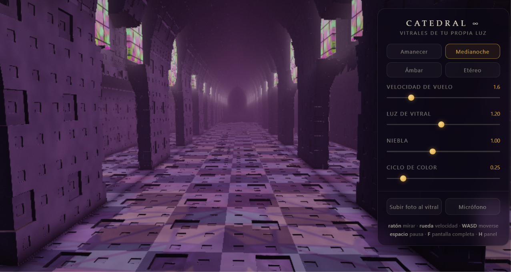

# Catedral Infinita ∞

Una catedral gótica fractal e infinita, renderizada en tiempo real con **raymarching en WebGL puro**. Sube una foto y se convierte en los vitrales: la imagen aparece en los ventanales, se pliega en caleidoscopio en los rosetones y sus tonos tiñen la luz de toda la escena.

**Un solo archivo HTML. Cero dependencias. Cero build.**

🔗 **Demo en vivo:** 

## Qué hace

- **Arquitectura por SDF**: nave central de arcos apuntados, naves laterales, arquerías, bóvedas anidadas que se repiten hacia dentro (recesión fractal) y tracería tipo Menger tallada en la piedra. Todo matemática, ni un solo polígono modelado.
- **Tu foto como vitral**: se mapea en las lancetas con líneas de plomo procedurales, y en los rosetones se muestrea con un pliegue caleidoscópico de 12 ejes — cualquier foto se convierte en rosetón. El color medio de la imagen colorea la niebla, el glow volumétrico y la luz que se proyecta sobre la piedra.
- **Paleta por defecto**: si no subes nada, arranca con un mosaico generado de azules, violetas, ámbar y granate.
- **4 ambientes** con transición suave: Amanecer, Medianoche, Ámbar y Etéreo.
- **Reactividad al micrófono** (opcional, con tu permiso): los vitrales pulsan con el sonido ambiente.
- **60 fps en un portátil normal**: resolución adaptativa que se autorregula según el frame time, pasos de raymarching limitados y epsilon dependiente de la distancia.

## Controles

| Entrada | Acción |
|---|---|
| Ratón | Mirar alrededor |
| Rueda | Acelerar / frenar el vuelo |
| `WASD` / flechas | Desplazamiento libre |
| `Espacio` | Pausar / reanudar el avance |
| `F` | Pantalla completa |
| `H` | Mostrar / ocultar el panel |
| Panel | Velocidad, luz de vitral, niebla, ciclo de color, ambientes, foto y micrófono |

## Cómo se ejecuta

No hay nada que instalar:

1. Descarga `index.html`.
2. Ábrelo en Chrome, Edge o Firefox recientes.

Para publicarlo basta cualquier hosting estático (GitHub Pages, Netlify, tu propio servidor). Único requisito: **HTTPS** si quieres que funcione el micrófono.

## Cómo funciona por dentro

- Un quad a pantalla completa y un fragment shader GLSL que hace **sphere tracing** sobre un campo de distancias con signo (SDF).
- La catedral se construye por operaciones CSG sobre arcos apuntados: la nave y las laterales se *tallan* de un sólido infinito, y las arquerías dejan los pilares de forma natural.
- El carácter fractal viene de dos sitios: bóvedas apuntadas anidadas que se repiten hacia el ápice, y un relieve de pliegue tipo Menger grabado en toda la piedra.
- Iluminación: oclusión ambiental por muestreo del SDF, glow volumétrico acumulado durante la marcha del rayo alrededor del vidrio, niebla exponencial, tonemapping ACES, viñeta y grano.
- La foto se procesa en un canvas (recorte tipo *cover*, orientación EXIF respetada) y se sube como textura; su color medio se pasa como uniform para teñir la luz global.

## Créditos

Creado por [Ángel Molina](https://angelmolina.net) · [Youtube](https://www.youtube.com/@angelmolinalaguna)

## Licencia

MIT — úsalo, aprende de él y hazlo tuyo.
